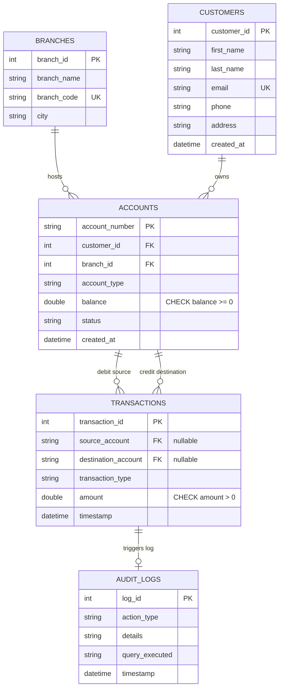

> **DBMS Mini-Project Report**
> **Technologies**: Node.js, Express.js, SQLite3, HTML5, Vanilla CSS3, Javascript (ES6)
---
## 1. Introduction & Objectives
The **Apex Bank Management System** is a lightweight web application designed to demonstrate core database management system (DBMS) concepts. The system models a banking core, managing branches, customers, multiple financial accounts, and transaction ledgers. 
### Key Project Objectives:
*   **Database Design**: Model relational tables with strict constraints (Primary Keys, Foreign Keys, Unique Keys, Check Constraints).
*   **ACID Compliance**: Demonstrate Transaction Management (Atomicity and Consistency) during credit/debit/transfer actions.
*   **Database Automation**: Implement SQL Triggers to create automated audit logging.
*   **Interactive Interface**: Provide a dashboard showing statistical insights, ledger lists, an interactive transaction desk, and a raw SQL query executor to explore DBMS concepts in real-time.
---
## 2. System Architecture
The application is structured as a client-server architecture with direct database bindings:
```
┌────────────────────────────────────────────────────────────────────────┐
│                        FRONTEND (Client Browser)                       │
│                                                                        │
│  ┌──────────────────┐  ┌──────────────────┐  ┌──────────────────────┐  │
│  │ Dashboard Cards  │  │ Transaction Desk │  │  DBMS Query Runner   │  │
│  └────────┬─────────┘  └────────┬─────────┘  └──────────┬───────────┘  │
└───────────┼─────────────────────┼───────────────────────┼──────────────┘
            │ HTTP GET            │ HTTP POST             │ HTTP POST
            ▼                     ▼                       ▼
┌────────────────────────────────────────────────────────────────────────┐
│                        BACKEND (Express.js Server)                     │
│                                                                        │
│  ┌──────────────────────────────────────────────────────────────────┐  │
│  │ API Routing & ACID Transaction Controllers (server.js)            │  │
│  └──────────────────────────────┬───────────────────────────────────┘  │
└─────────────────────────────────┼──────────────────────────────────────┘
                                  │ SQL Commands (All queries logged)
                                  ▼
┌────────────────────────────────────────────────────────────────────────┐
│                     DATABASE LAYER (SQLite engine)                      │
│                                                                        │
│  ┌──────────────┐   ┌──────────────┐   ┌──────────────┐                 │
│  │    Tables    │   │ Constraints  │   │   Triggers   │                 │
│  │ (schema.sql) │   │ (CHECK / FK) │   │ (Audit logs) │                 │
│  └──────────────┘   └──────────────┘   └──────────────┘                 │
└────────────────────────────────────────────────────────────────────────┘
```
---
## 3. Database Design
### 3.1 Entity-Relationship (ER) Diagram
Below is the ER Diagram of the system represented in Chen/Crow's Foot notation:

### 3.2 Relational Schema
*   **branches** = { <u>branch_id</u>, branch_name, branch_code, city }
*   **customers** = { <u>customer_id</u>, first_name, last_name, email, phone, address, created_at }
*   **accounts** = { <u>account_number</u>, *customer_id*, *branch_id*, account_type, balance, status, created_at }
*   **transactions** = { <u>transaction_id</u>, *source_account*, *destination_account*, transaction_type, amount, timestamp }
*   **audit_logs** = { <u>log_id</u>, action_type, details, query_executed, timestamp }
---
## 4. Key DBMS Concepts Demonstrated
### 4.1 Constraints & Referential Integrity
*   **Primary Keys**: Uniquely identify records in all tables (`branch_id`, `customer_id`, `account_number`, `transaction_id`, `log_id`).
*   **Foreign Keys**: Set up referential integrity. Removing a branch or customer is blocked if active accounts exist (`ON DELETE RESTRICT` constraint).
*   **Check Constraints**: Enforce domain rules directly inside the storage engine:
    *   `CHECK(balance >= 0.0)` in the `accounts` table stops accounts from going into unauthorized overdraft.
    *   `CHECK(amount > 0.0)` in the `transactions` table guarantees all financial transfers represent a positive number.
    *   `CHECK(account_type IN ('SAVINGS', 'CHECKING', 'LOAN'))` keeps inputs valid.
*   **Unique Keys**: The `email` column in the `customers` table and `branch_code` in the `branches` table are declared `UNIQUE` to prevent duplicates.
### 4.2 ACID Transactions Management (Atomic Transfers)
When money is transferred from Account A to Account B, the operation must be completed fully, or not at all (Atomicity). The database state must also remain balanced (Consistency).
The system executes the following steps inside a single transaction scope:
```sql
BEGIN TRANSACTION;
-- Deduct from sender (Checks check constraint balance >= 0)
UPDATE accounts SET balance = balance - 100.00 
WHERE account_number = 'ACC-10001';
-- Credit receiver
UPDATE accounts SET balance = balance + 100.00 
WHERE account_number = 'ACC-30001';
-- Insert transaction logs record
INSERT INTO transactions (source_account, destination_account, transaction_type, amount) 
VALUES ('ACC-10001', 'ACC-30001', 'TRANSFER', 100.00);
COMMIT;
```
If the sender has insufficient funds, the first `UPDATE` statement fails the database constraint `CHECK(balance >= 0)`. The database engine fires an exception, which the backend catches, immediately executing `ROLLBACK;`. Both accounts remain unchanged, preserving Consistency.
### 4.3 Database Triggers (Automation)
Triggers automate operations inside the database engine. For instance, when a transaction occurs, the trigger logs the action into the `audit_logs` table:
```sql
CREATE TRIGGER log_new_transaction
AFTER INSERT ON transactions
BEGIN
    INSERT INTO audit_logs (action_type, details, query_executed)
    VALUES (
        'TRANSACTION_RECORDED',
        'Transaction ID ' || NEW.transaction_id || ': ' || NEW.transaction_type || ' of $' || NEW.amount,
        'INSERT INTO transactions(...);'
    );
END;
```
---
## 5. Deployment and Setup Procedure
Follow these instructions to run the project locally on your Windows system.
### Prerequisites:
1.  **Node.js**: Install the LTS version of Node.js from the official site (https://nodejs.org/).
2.  **Environment**: Command Prompt (cmd) or PowerShell.
### Step-by-Step Execution:
#### 1. Setup the Project Directory
Ensure all project files are placed in a folder (e.g., `bank-management-system`):
```cmd
cd C:\Users\ASUS\.gemini\antigravity\scratch\bank-management-system
```
#### 2. Install Project Dependencies
Run the install command to fetch `express` and `sqlite3` packages:
```cmd
npm install
```
#### 3. Initialize & Seed Database
Initialize the schema and seed mock transactions, branches, accounts, and customers:
```cmd
npm run init-db
```
This command runs `init_db.js`, which reads `database/schema.sql`, builds the database structure, compiles triggers, and populates the records. You will see confirmation logs in your terminal.
#### 4. Start the Application Server
Run the startup script:
```cmd
npm start
```
The server will boot up and bind to Port 3000. You should see:
```text
================================================================
 BANK MANAGEMENT SYSTEM IS RUNNING AT: http://localhost:3000
================================================================
```
#### 5. Open in Web Browser
Open your browser and navigate to:
```text
http://localhost:3000
```
You can now register customers, execute transactional deposits/withdrawals/transfers, review audit logs, and run custom queries in the SQL console.